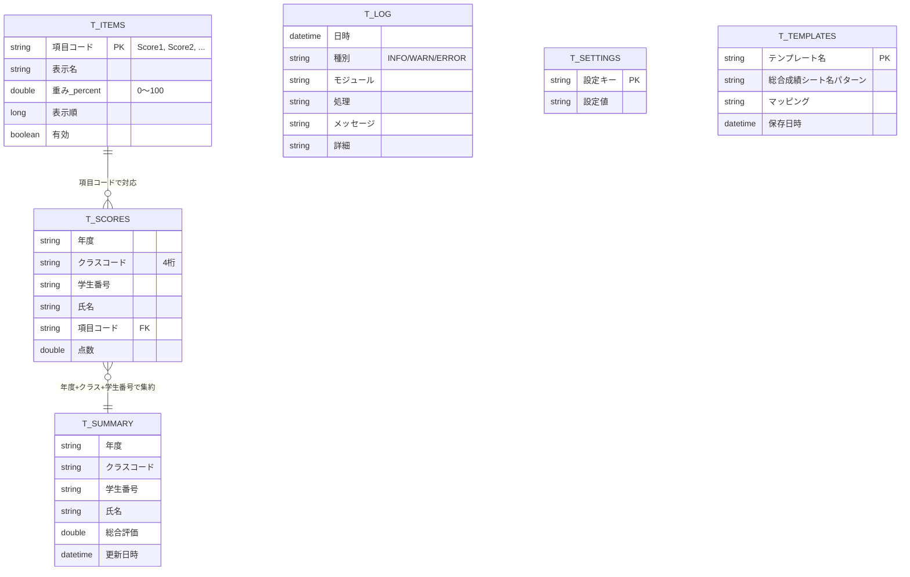

# データベース設計書

## 1. 設計方針

- Excel標準の「テーブル」（ListObject）を記憶領域として使用する
  （外部データベース・PowerQuery・外部ライブラリは使用しない）。
- **縦持ち（ロング形式）** を採用し、評価項目数がいくつになっても
  テーブル構造（列定義）の変更が不要な設計とする。
- 元Excel（外部ファイル）の内容は一切保存しない。取込時に必要な値のみを
  読み取り、変換した上で内部テーブルへ書き込む。
- 総合評価は学生ごとに1件のキャッシュ値として `T_Summary` に保持し、
  評価項目の点数（`T_Scores`）に重複して持たせない。これにより
  項目数が多い学生でも総合評価の保存容量が増加しない。

## 2. ER図



`T_Scores` と `T_Summary` はいずれも独立したテーブルであり、
外部キー制約はExcelの仕組み上持てないため、VBA側（`mod_Database`）が
整合性維持を担う（インポート時・重み変更時に `RecalcSummary` を呼び出す）。

## 3. テーブル定義

### 3.1 T_Scores（評価点数、縦持ち）— 非表示シート D_Scores 上

| 列名 | 型 | 説明 |
|---|---|---|
| 年度 | 文字列 | 例: "2026" |
| クラスコード | 文字列（4桁） | 例: "0101" |
| 学生番号 | 文字列 | 元データの学生番号をそのまま保持 |
| 氏名 | 文字列 | |
| 項目コード | 文字列 | 内部名。"Score1", "Score2", ... |
| 点数 | 数値 | |

一意キー: `年度 + クラスコード + 学生番号 + 項目コード`
（重複判定・上書き取込で使用）

**保存しない列**: 細目成績、各科目の点数、元シートのその他情報。
総合評価は本テーブルに保持しない（`T_Summary` を参照）。

### 3.2 T_Items（評価項目マスタ）— 「設定」シート上

| 列名 | 型 | 説明 |
|---|---|---|
| 項目コード | 文字列 | PK。"Score1" のように自動採番 |
| 表示名 | 文字列 | 利用者が設定画面で自由に変更可能 |
| 重み(%) | 数値 | 0〜100の相対値。合計100%である必要はない |
| 表示順 | 数値 | 分析画面等での表示順 |
| 有効 | 論理値 | 無効化した項目は選択肢から除外できる |

新しい評価項目は、データ取込時にマッピングで「新規評価項目」として
指定されると自動的に1行追加される（`mod_Settings.GetOrCreateItem`）。
これにより3項目・4項目・5項目・10項目いずれの構成にも
コード変更なしで対応する。

### 3.3 T_Summary（学生別総合評価キャッシュ）— 「データベース」シート上

| 列名 | 型 | 説明 |
|---|---|---|
| 年度 | 文字列 | |
| クラスコード | 文字列 | |
| 学生番号 | 文字列 | |
| 氏名 | 文字列 | |
| 総合評価 | 数値 | 下記の計算式で算出（小数点2桁に丸め） |
| 更新日時 | 日時 | 再計算時に更新 |

一意キー: `年度 + クラスコード + 学生番号`

**総合評価の計算式**

```
総合評価 = Σ(点数i × 重みi) / Σ(重みi)   （その学生が保有する項目のみを対象）
```

重みが変更された場合、`mod_Settings.ApplyItemSettingsChanged` から
`mod_Database.RecalcSummary` が呼び出され、全件（または指定した
年度・クラスのみ）再計算される。

### 3.4 T_Log（操作・エラーログ）— 「ログ」シート上

| 列名 | 型 | 説明 |
|---|---|---|
| 日時 | 日時 | |
| 種別 | 文字列 | INFO / WARN / ERROR |
| モジュール | 文字列 | 発生元モジュール名 |
| 処理 | 文字列 | 発生元プロシージャ名 |
| メッセージ | 文字列 | 利用者向け要約 |
| 詳細 | 文字列 | エラー番号等の技術的詳細 |

保持上限（既定5000件、`T_Settings!LOG_MAX_ROWS` で変更可）を超えると、
最も古い行から自動的に削除される。

### 3.5 T_Settings（キー・バリュー設定）— 「設定」シート上

| 設定キー | 既定値 | 説明 |
|---|---|---|
| HIST_BIN_MODE | COUNT | ヒストグラムのビン指定方法（COUNT=件数指定 / WIDTH=幅指定） |
| HIST_BIN_COUNT | 10 | ビン数指定時の既定ビン数 |
| HIST_BIN_WIDTH | 10 | ビン幅指定時の既定ビン幅 |
| GRAPH_SHOW_NORMAL | TRUE | 正規分布重畳表示の既定値 |
| GRAPH_OVERLAY_YEARS | TRUE | 複数年度重畳表示の既定値 |
| LOG_MAX_ROWS | 5000 | ログの最大保持件数 |

分析画面の各コントロールが優先されるが、初期値としてこれらの
設定値が使用される。

### 3.6 T_Templates（列マッピングテンプレート）— 非表示シート D_Templates 上

| 列名 | 型 | 説明 |
|---|---|---|
| テンプレート名 | 文字列 | PK |
| 総合成績シート名パターン | 文字列 | 保存時点のシート名（参考情報） |
| マッピング | 文字列 | `見出し1=対象1;見出し2=対象2;...` 形式 |
| 保存日時 | 日時 | |

JSON等の外部パーサに依存しないよう、単純な区切り文字列
（`Split` 関数のみで解析可能な形式）で保存する。

## 4. 容量対策

- 元Excel（外部ファイル）そのもの、細目成績・各科目シート・その他情報は
  一切保存しない。取込処理はメモリ上の配列を経由してのみ内部テーブルへ
  書き込む。
- 総合評価は学生1名につき1行のキャッシュとして保持し、評価項目数分の
  重複を持たない。
- ログは既定5000件を上限に自動間引きされる。
- 「データベース」画面から、不要になった年度・クラス単位でデータを
  完全に削除できる（`mod_Database.DeleteByYearClass`）。

これらにより、20名クラス・200名学年規模のデータを想定した通常運用では、
10年以上の利用でもファイルサイズの増加を小さく抑えられる設計としている。
