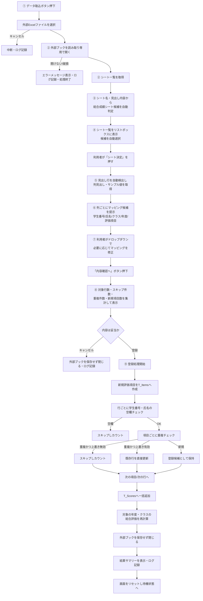
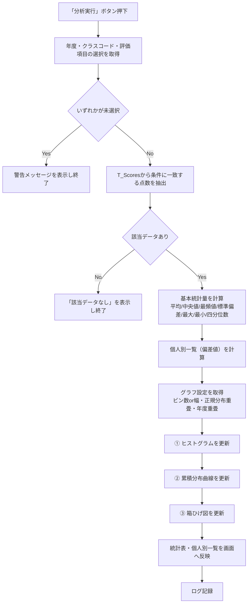
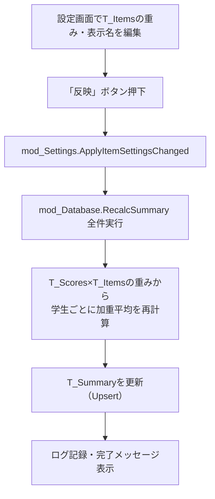
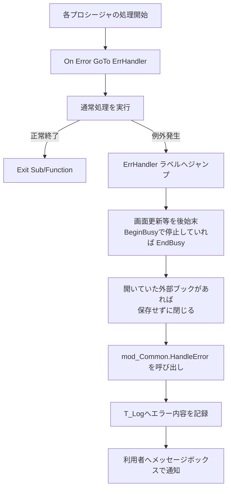

# 処理フロー図

## 1. データ取込フロー（①〜⑨）

## 2. 分析実行フロー

## 3. 評価項目の重み変更フロー

## 4. エラー処理の共通フロー

主な想定エラーと対応（詳細は `docs/03_データベース設計書.md` および
各モジュールのコメントを参照）:

| 事象 | 対応 |
|---|---|
| シート名変更 | シート名＋見出し内容の両面から候補を推定。誤っていれば利用者が一覧から選び直せる |
| 列名変更 | 見出しの部分一致・正規化比較でマッピング候補を推定。ドロップダウンで修正可能 |
| 列順変更 | 列位置ではなく見出し文字列でマッピングするため影響を受けない |
| 空データ（学生番号/氏名が空欄） | その行をスキップし件数を集計・表示 |
| 重複登録 | 既定はスキップ。「上書き」チェックで既存データの更新も可能 |
| 途中キャンセル | 各ステップに用意されたキャンセル操作で、外部ブックを保存せず閉じて中断。
  内部テーブルへの書き込みは⑨の最終段階でのみ行うため、中間状態が
  内部データに残ることはない |
| ファイル破損 | `Workbooks.Open` のエラーを捕捉し、メッセージ表示・ログ記録の上で処理を終了 |
